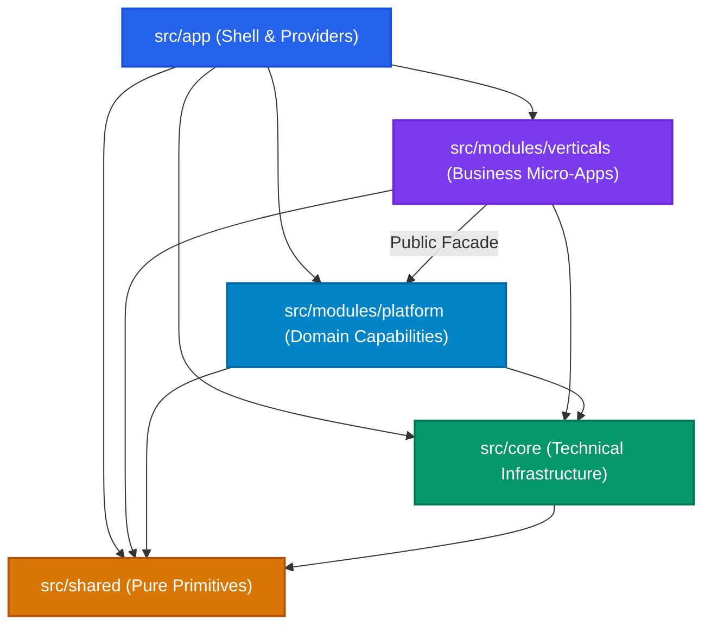
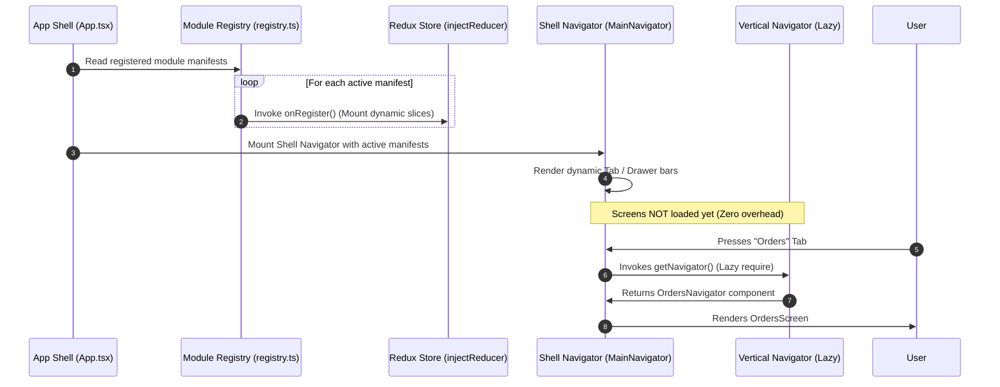
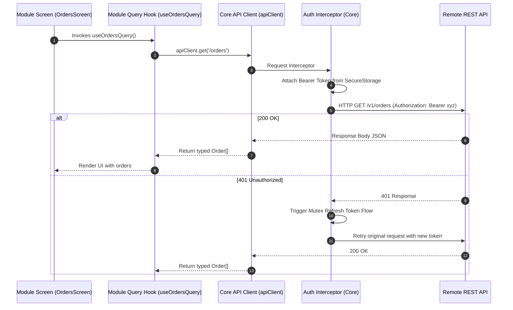

# Modular (Vertical-Slice) Architecture in React Native
### Enterprise Engineering Blueprint & Reference Guide

---

## Technical Baseline & Assumptions

* **Navigation**: React Navigation (v6 / v7 Native Stack & Bottom Tabs) with lazy-evaluated navigators.
* **State Management**:
  * **Server State**: TanStack React Query v5 (scoped query key factories per module).
  * **Client / UI State**: Redux Toolkit (base core store with dynamic runtime reducer injection) + local React state.
* **Data & Storage**: Axios client singleton with token refresh interceptors + `react-native-mmkv` persistence.
* **Repository Architecture**: Single application codebase with clean module boundaries via path aliases (`@app`, `@modules`, `@core`, `@shared`).
* **Language & Quality Gates**: TypeScript 5.x (Strict Mode) + ESLint with `eslint-plugin-import` (`no-restricted-paths`, `no-cycle`).

---

## 1. Overview: What Modular Architecture Means in React Native

In a standard React Native codebase, applications typically start with a **horizontal, technical-layer structure**: all components in `components/`, all screens in `screens/`, all API calls in `services/`, and all reducers in `store/`.

While this works for simple apps (under 10 screens, 1–2 developers), it breaks down rapidly as teams scale.

A **Modular (Vertical-Slice) Architecture** reorganizes the codebase around **business domains**. Each distinct business capability (such as `orders`, `billing`, or `profile`) is packaged as an autonomous, self-contained micro-feature containing its own screens, business logic, private components, data layer, translations, and navigation:

```
┌────────────────────────────────────────────────────────────────────────┐
│                   Vertical Feature Module (e.g., orders)               │
│                                                                        │
│   Screens ──► Components ──► Services ──► Redux Slice ──► Types ──► i18n│
│   (Fully co-located, independently testable, and cleanly deletable)    │
└────────────────────────────────────────────────────────────────────────┘
```

### Why Teams Choose This Pattern

1. **Autonomous Squad Ownership**: Teams can own distinct business domains without file conflicts in shared directories or Git histories.
2. **Zero Merge Conflicts on Releases**: No central `rootReducer.ts` or monolithic `routes.ts` file that every pull request touches.
3. **True Feature Deletability**: Retiring a feature requires deleting its folder and unregistering one line. Sibling code never imports from it.
4. **Optimized Startup Time (TTI)**: Metro bundler evaluation is deferred. Heavy screens and feature dependencies are loaded on demand.
5. **Contained Blast Radius**: A bug or regression in `orders` cannot break `auth` or sibling features.

---

## 2. Vertical vs. Horizontal Structure

### Side-by-Side Comparison of the Same Sample App

Consider a mobile app featuring **Auth**, **Profile**, **Orders**, and **Notifications**.

#### Horizontal (Layer-Based) Organization
```text
src/
├── components/
│   ├── Button.tsx
│   ├── OrderCard.tsx             # Orders domain
│   ├── UserAvatar.tsx            # Profile domain
│   └── NotificationRow.tsx       # Notifications domain
├── screens/
│   ├── LoginScreen.tsx           # Auth domain
│   ├── OrdersListScreen.tsx      # Orders domain
│   ├── OrderDetailScreen.tsx     # Orders domain
│   ├── ProfileScreen.tsx         # Profile domain
│   └── NotificationsScreen.tsx   # Notifications domain
├── navigation/
│   ├── AppNavigator.tsx          # Monolithic navigation file
│   └── types.ts                  # Every screen param mixed together
├── services/
│   ├── api.ts                    # Single Axios instance
│   ├── auth.service.ts
│   ├── orders.service.ts
│   └── notifications.service.ts
└── store/
    ├── rootReducer.ts            # Statically imports every slice
    ├── authSlice.ts
    └── ordersSlice.ts
```

#### Vertical (Modular-Slice) Organization
```text
src/
├── app/                          # Application Shell & Composition Root
│   ├── App.tsx                   # Mounts root providers
│   └── navigation/
│       ├── root-navigator.tsx    # Auth gate, platform screens & shell tabs
│       └── navigation.types.ts   # Root-level navigation contracts
│
├── modules/                      # Business Domains & Platform Capabilities
│   ├── registry.ts               # Central module discovery hub
│   ├── module.types.ts           # Module manifest contract
│   │
│   ├── platform/                 # Reusable Domain & Platform Capabilities
│   │   ├── auth/                 # Login, signup, password reset screens & hooks
│   │   ├── location/             # GPS permission, address picker
│   │   ├── notifications/        # Push inbox, notification settings
│   │   ├── settings/             # App preferences, language switcher
│   │   ├── routes.ts             # Platform screen route constants
│   │   └── index.ts              # Unified @modules/platform public facade
│   │
│   └── verticals/                # Independent Business Micro-Apps
│       ├── orders/               # Orders Domain (Self-Contained)
│       │   ├── components/       # OrderCard, OrderStatusBadge (private)
│       │   ├── constants/        # Screen enums, order statuses
│       │   ├── hooks/            # useOrderDetails, useOrderFilter
│       │   ├── i18n/             # en.json, ar.json
│       │   ├── navigation/       # orders.navigator.tsx, orders.routes.ts
│       │   ├── screens/          # OrdersListScreen, OrderDetailScreen
│       │   ├── services/         # orders.api.ts, orders.queries.ts
│       │   ├── store/            # orders.slice.ts (dynamic injection)
│       │   ├── types/            # orders.types.ts
│       │   └── manifest.ts       # Single public integration contract
│       │
│       └── profile/              # Profile Domain (Self-Contained)
│           ├── components/       # UserAvatar, EditProfileModal
│           ├── screens/          # ProfileScreen, EditProfileScreen
│           ├── navigation/       # profile.navigator.tsx
│           ├── services/         # profile.api.ts
│           ├── types/            # profile.types.ts
│           └── manifest.ts
│
├── core/                         # Headless Technical Infrastructure
│   ├── networking/               # Axios client singleton, auth interceptors
│   ├── storage/                  # MMKV storage & secure keychain wrappers
│   ├── store/                    # Base Redux store + injectReducer engine
│   └── i18n/                     # Base i18next engine + dynamic bundle loader
│
└── shared/                       # 100% Pure Domain-Agnostic UI & Primitives
    ├── components/               # Button, TextInput, Card, Modal, Typography
    ├── theme/                    # Colors, Spacing, Typography tokens
    ├── hooks/                    # useDebounce, useAppTheme, useKeyboard
    └── utils/                    # formatCurrency, formatDate, validation
```

---

### Day-to-Day Engineering Workflow Changes

| Dimension | Horizontal Architecture | Vertical-Slice Architecture |
| :--- | :--- | :--- |
| **Finding Code** | Juggling 5 distant folders (`screens/`, `components/`, `services/`, `store/`). | **Single directory**. Everything for `orders` is in `src/modules/verticals/orders/`. |
| **Making Changes** | Edits touch files across the tree; high risk of breaking shared components. | **Isolated blast radius**. Components and helpers are private to the vertical. |
| **Code Ownership** | Shared global files cause merge conflicts and unclear PR review ownership. | **Clear CODEOWNERS**. Squad Orders owns `src/modules/verticals/orders/**`. |
| **Feature Deletion** | Risky, time-consuming audit to untangle scattered files. | **Clean removal**. Delete the folder, remove 1 line in `registry.ts`. |

---

## 3. Root Folder Breakdown: Responsibilities & Boundaries

```text
src/
├── app/                       ──► Composition Root & Host Shell
├── modules/
│   ├── platform/              ──► Reusable Domain & Platform Services
│   └── verticals/             ──► Isolated Business Micro-Apps
├── core/                      ──► Headless Technical Infrastructure
└── shared/                    ──► Pure Domain-Agnostic Primitives
```

---

### 3.1 `src/app/` (Composition Root & Host Shell)
* **Responsibility**: Boots the React Native runtime, mounts providers, and configures the root navigation shell.
* **Belongs Here**:
  * `App.tsx` (Root React entry point).
  * Provider assembly (`StoreProvider`, `QueryClientProvider`, `ThemeProvider`).
  * Root navigation shell (`RootNavigator.tsx`, dynamic tab bar, deep link prefixes).
* **Must NOT Belong Here**:
  * Feature screens or domain-specific business components.
  * Direct API calls, queries, or business state slices.
* **Import Rules**:
  * **May import from**: `modules/` (`registry.ts` and manifests only), `core/`, `shared/`.
  * **Who may import it**: **Nobody**. `app/` is the top-level composition root.

---

### 3.2 `src/modules/` (Business Domains & Platform Capabilities)

Divided into two explicit tiers:

#### A. `src/modules/verticals/` (Business Micro-Apps)
* **Responsibility**: Self-contained product verticals (`orders`, `billing`, `booking`).
* **Belongs Here**: Private screens, internal stack navigators, domain queries, localized state, validation schemas, and `manifest.ts`.
* **Must NOT Belong Here**: Global infrastructure singletons or direct imports to sibling verticals.
* **Import Rules**:
  * **May import from**: `src/core/`, `src/shared/`, and `@modules/platform` (via public facade).
  * **Forbidden imports**: Sibling verticals (`../<sibling>/*`), `src/app/*`.

#### B. `src/modules/platform/` (Reusable Domain Capabilities)
* **Responsibility**: Cross-cutting domain capabilities that multiple verticals rely on (e.g., `auth`, `location`, `notifications`, `settings`).
* **Belongs Here**: Platform screens (Login, Location Picker), session hooks, push handlers, and the unified public facade `index.ts`.
* **Must NOT Belong Here**: Business vertical logic or direct imports from `src/modules/verticals/`.
* **Import Rules**:
  * **May import from**: `src/core/`, `src/shared/`.
  * **Who may import it**: `src/app/` and `src/modules/verticals/` (via `@modules/platform` facade only).

---

### 3.3 `src/core/` (Headless Technical Infrastructure)
* **Responsibility**: Provides headless, UI-agnostic technical services and device capabilities.
* **Belongs Here**:
  * `networking/`: Axios client singleton, request/response interceptors, token refresh mutex.
  * `storage/`: MMKV key-value storage and secure hardware keychain adapters.
  * `store/`: Base Redux store instance and dynamic reducer injection engine (`injectReducer`).
  * `i18n/`: Base i18next engine and `registerTranslationBundle()` helper.
* **Must NOT Belong Here**:
  * React UI components, screens, or JSX.
  * Feature-specific business logic or domain types.
* **Import Rules**:
  * **May import from**: `src/shared/` and external libraries.
  * **Who may import it**: `src/app/`, `src/modules/`.
  * **Forbidden imports**: `src/app/*`, `src/modules/*`.

---

### 3.4 `src/shared/` (Pure Primitives & Design System)
* **Responsibility**: Domain-agnostic UI building blocks and generic utilities.
* **Belongs Here**:
  * Design system primitives (`BaseButton`, `Typography`, `Input`, `Card`, `Modal`, `Skeleton`).
  * Theme tokens: Color palettes, typography scales, spacing tokens.
  * Generic React hooks (`useDebounce`, `useKeyboard`, `useAppTheme`).
  * Pure utilities: Date formatters, currency parsers, regex validators.
* **Must NOT Belong Here**:
  * Domain models or business entity types (`Order`, `User`, `Cart`).
  * Route names or screen parameters.
  * API endpoints, network calls, or state stores.
* **Import Rules**:
  * **May import from**: External libraries only (`react-native`, `date-fns`).
  * **Who may import it**: `src/app/`, `src/modules/`, `src/core/`.
  * **Forbidden imports**: `src/app/*`, `src/modules/*`, `src/core/*`. **100% independent.**

---

## 4. Dependency Rules & Boundaries

### Folder Dependency Hierarchy Diagram



---

### Dependency Matrix Table

| Folder | Can Import From | Cannot Import From | Rationale |
| :--- | :--- | :--- | :--- |
| **`src/app`** | `modules/registry`, `core`, `shared` | *None* | Top-level shell that wires modules and providers. |
| **`src/modules/verticals/<v>`** | `core`, `shared`, `@modules/platform` | `app`, Sibling verticals (`../<other>/*`) | Verticals must remain completely decoupled from one another. |
| **`src/modules/platform`** | `core`, `shared` | `app`, `modules/verticals` | Platform features provide services to verticals, not vice-versa. |
| **`src/core`** | `shared`, external libraries | `app`, `modules` | Technical foundation must remain domain-agnostic. |
| **`src/shared`** | External libraries only | `app`, `modules`, `core` | Design primitives must be 100% self-contained. |

---

### Module-to-Module Communication Without Direct Imports

When a vertical feature needs data or actions from another domain (e.g., `orders` needing user profile data or opening a chat screen), **never import from `../profile` or `../chat` directly**.

Use these decoupled communication patterns:

#### 1. The `@modules/platform` Facade
Verticals consume cross-cutting domain services through the platform facade:

```typescript
// Inside src/modules/verticals/orders/screens/OrderDetailScreen.tsx:
// Safe: consumes the public platform contract
import { useSession, useLocation } from '@modules/platform';

const { user } = useSession();
const { currentCity } = useLocation();
```

#### 2. Headless Navigation via Core
To navigate across domains without importing foreign route enums:

```typescript
// src/core/navigation/navigation.service.ts
import { createNavigationContainerRef, ParamListBase } from '@react-navigation/native';

export const navigationRef = createNavigationContainerRef<ParamListBase>();

export function navigate(name: string, params?: Record<string, unknown>): void {
  if (navigationRef.isReady()) {
    (navigationRef.navigate as any)(name, params);
  }
}
```

```typescript
// Invoked from src/modules/verticals/orders/screens/OrderDetailScreen.tsx:
import { navigate } from '@core/navigation';

const handleContactSupport = () => {
  navigate('ChatRoom', { orderId: 'ord_123' });
};
```

---

## 5. Cross-Cutting Features: Auth and Notifications

Features like **Auth** and **Notifications** have both technical infrastructure and domain UI. In this architecture, they are cleanly separated between `core/` and `modules/platform/`:

```
┌─────────────────────────────────────────┐
│     src/modules/platform/auth           │  ◄── User-Facing: LoginScreen, RegisterScreen,
│     src/modules/platform/notifications  │      NotificationInbox, useSession() hook
└────────────────────┬────────────────────┘
                     │ (Delegates to)
┌────────────────────▼────────────────────┐
│     src/core/networking (Axios Interceptors)   ◄── Headless: JWT Storage, 401 Mutex,
│     src/core/notifications (Native Dispatcher)      APNS/FCM Native Listeners
└─────────────────────────────────────────┘
```

---

### How Verticals Consume Cross-Cutting Features Without Coupling

#### 1. The Session Provider (`@modules/platform`)
Verticals never inspect tokens or handle login state directly:

```typescript
// src/modules/platform/auth/hooks/use-session.hook.ts
import { useSelector } from 'react-redux';
import type { RootState } from '@core/store/redux.store';

export const useSession = () => {
  const session = useSelector((state: RootState) => state.session);
  return {
    isAuthenticated: Boolean(session?.token),
    user: session?.user ?? null,
  };
};
```

#### 2. Route Guards in `src/app/`
Authentication route gating happens at the root navigation level:

```typescript
// src/app/navigation/root-navigator.tsx
import React from 'react';
import { createNativeStackNavigator } from '@react-navigation/native-stack';
import { useSession } from '@modules/platform';
import AuthNavigator from '@modules/platform/auth/navigation/auth.navigator';
import MainNavigator from './main-navigator';

const Stack = createNativeStackNavigator();

export const RootNavigator = () => {
  const { isAuthenticated } = useSession();

  return (
    <Stack.Navigator screenOptions={{ headerShown: false }}>
      {isAuthenticated ? (
        <Stack.Screen name="Main" component={MainNavigator} />
      ) : (
        <Stack.Screen name="Auth" component={AuthNavigator} />
      )}
    </Stack.Navigator>
  );
};
```

#### 3. Notification Handler Registration Pattern
Verticals register route handlers with the notification router at boot, rather than listening to Firebase directly:

```typescript
// src/modules/verticals/orders/manifest.ts
import { notificationRouter } from '@core/notifications';
import { navigate } from '@core/navigation';

notificationRouter.registerHandler('ORDER_STATUS_UPDATE', (payload) => {
  navigate('OrderDetail', { orderId: payload.orderId });
  return true;
});
```

---

## 6. Navigation Architecture & Route Registration

Navigation is partitioned into two tiers:
1. **The Shell Navigator (`src/app/navigation/`)**: Hosts root gates and dynamic tab/drawer containers.
2. **Per-Vertical Navigators (`src/modules/verticals/<v>/navigation/`)**: Encapsulates internal screen transitions.

### Module Registration Flow Diagram



---

### The `ModuleManifest` Contract

Every vertical module exports its capabilities through a typed manifest:

```typescript
// src/modules/module.types.ts
import type { ComponentType } from 'react';

export type ModuleManifest = {
  /** Unique domain identifier (e.g., 'orders', 'profile') */
  id: string;

  /** Display title for tab bars and headers */
  title: string;

  /** Optional icon name for bottom tabs */
  iconName?: string;

  /** Feature flag key to gate access */
  flag?: string;

  /** Lazy Navigation Loader: Defers evaluation until tapped */
  getNavigator: () => ComponentType<any>;

  /** Lifecycle Hook: Invoked at boot (e.g., dynamic reducer injection) */
  onRegister?: () => void;

  /** Lifecycle Hook: Invoked on logout to purge local state */
  onLogout?: () => void;
};
```

---

### The Dynamic Shell Navigator (`src/app/navigation/main-navigator.tsx`)

The host shell dynamically renders tabs from active manifests without hardcoding vertical screens:

```typescript
// src/app/navigation/main-navigator.tsx
import React from 'react';
import { createBottomTabNavigator } from '@react-navigation/bottom-tabs';
import { useSelector } from 'react-redux';
import { getActiveVerticals } from '@modules/registry';
import type { RootState } from '@core/store/redux.store';

const Tab = createBottomTabNavigator();

export const MainNavigator = () => {
  const flags = useSelector((state: RootState) => state.flags);
  const activeVerticals = getActiveVerticals(flags);

  return (
    <Tab.Navigator screenOptions={{ headerShown: false, lazy: true }}>
      {activeVerticals.map(vertical => (
        <Tab.Screen
          key={vertical.id}
          name={vertical.id}
          options={{ title: vertical.title }}
          getComponent={vertical.getNavigator}
        />
      ))}
    </Tab.Navigator>
  );
};

export default MainNavigator;
```

---

## 7. Networking & API Layer

Networking is divided between a **centralized HTTP engine in `core/`** and **isolated API services in each vertical**.

### Request Flow Diagram



---

### 7.1 Core Shared HTTP Client & Token Refresh Mutex

Core owns the Axios singleton, token injection, and refresh mutex queue so verticals never handle JWT mechanics:

```typescript
// src/core/networking/api-client.ts
import axios, { AxiosError, InternalAxiosRequestConfig } from 'axios';
import { SecureStorage } from '@core/storage/secure-storage';

export const apiClient = axios.create({
  baseURL: 'https://api.example.com/v1',
  timeout: 15000,
  headers: { 'Content-Type': 'application/json' },
});

// Automatic token attachment
apiClient.interceptors.request.use(async (config: InternalAxiosRequestConfig) => {
  const token = SecureStorage.getString('auth_token');
  if (token && config.headers) {
    config.headers.Authorization = `Bearer ${token}`;
  }
  return config;
});

// Mutex Token Refresh Queue
let isRefreshing = false;
let failedQueue: Array<{ resolve: (token: string) => void; reject: (err: any) => void }> = [];

const processQueue = (error: any, token: string | null = null) => {
  failedQueue.forEach(prom => (error ? prom.reject(error) : prom.resolve(token!)));
  failedQueue = [];
};

apiClient.interceptors.response.use(
  response => response,
  async (error: AxiosError) => {
    const originalRequest = error.config as InternalAxiosRequestConfig & { _retry?: boolean };

    if (error.response?.status === 401 && !originalRequest._retry) {
      if (isRefreshing) {
        return new Promise((resolve, reject) => {
          failedQueue.push({ resolve, reject });
        }).then(token => {
          originalRequest.headers.Authorization = `Bearer ${token}`;
          return apiClient(originalRequest);
        });
      }

      originalRequest._retry = true;
      isRefreshing = true;

      try {
        const refreshToken = SecureStorage.getString('refresh_token');
        const res = await axios.post('https://api.example.com/v1/auth/refresh', { refreshToken });
        const newToken = res.data.accessToken;

        SecureStorage.setString('auth_token', newToken);
        processQueue(null, newToken);

        originalRequest.headers.Authorization = `Bearer ${newToken}`;
        return apiClient(originalRequest);
      } catch (refreshErr) {
        processQueue(refreshErr, null);
        return Promise.reject(refreshErr);
      } finally {
        isRefreshing = false;
      }
    }

    return Promise.reject(error);
  }
);
```

---

### 7.2 Per-Module Services & Query Key Factories

Each vertical defines endpoints and React Query hooks using a localized **Query Key Factory** to prevent cache collisions:

```typescript
// src/modules/verticals/orders/services/orders.keys.ts
export const orderKeys = {
  all: ['orders'] as const,
  lists: () => [...orderKeys.all, 'list'] as const,
  detail: (id: string) => [...orderKeys.all, 'detail', id] as const,
};
```

```typescript
// src/modules/verticals/orders/services/orders.api.ts
import { apiClient } from '@core/networking/api-client';
import type { Order } from '../types/orders.types';

export const fetchOrders = async (): Promise<Order[]> => {
  const response = await apiClient.get<Order[]>('/orders');
  return response.data;
};

export const fetchOrderDetail = async (orderId: string): Promise<Order> => {
  const response = await apiClient.get<Order>(`/orders/${orderId}`);
  return response.data;
};
```

```typescript
// src/modules/verticals/orders/services/orders.queries.ts
import { useQuery } from '@tanstack/react-query';
import { orderKeys } from './orders.keys';
import { fetchOrders, fetchOrderDetail } from './orders.api';

export const useOrdersQuery = () => {
  return useQuery({
    queryKey: orderKeys.lists(),
    queryFn: fetchOrders,
  });
};

export const useOrderDetailQuery = (orderId: string) => {
  return useQuery({
    queryKey: orderKeys.detail(orderId),
    queryFn: () => fetchOrderDetail(orderId),
    enabled: Boolean(orderId),
  });
};
```

---

## 8. State Management: Global vs. Module-Scoped

| Scope | Location | Tool | Examples |
| :--- | :--- | :--- | :--- |
| **Global State** | `src/core/store/` | Redux Toolkit (Static Slices) | Auth session, feature flags, global theme, network connectivity. |
| **Module Server State** | `src/modules/verticals/<v>/services/` | TanStack React Query | Orders list, order details, pagination cache. |
| **Module Client State** | `src/modules/verticals/<v>/store/` | Dynamic Redux Slice | Active checkout drafts, filter/sorting selections, multi-step forms. |

---

### Dynamic Reducer Injection Engine

To prevent the root Redux store from statically importing every vertical's slice upfront, `core/store` uses runtime injection:

```typescript
// src/core/store/redux.store.ts
import { configureStore, combineReducers, Reducer } from '@reduxjs/toolkit';
import { flagsReducer } from './flags.slice';

const staticReducers = {
  flags: flagsReducer,
};

const asyncReducers: Record<string, Reducer<any>> = {};

const createRootReducer = () =>
  combineReducers({
    ...staticReducers,
    ...asyncReducers,
  });

export const store = configureStore({
  reducer: createRootReducer(),
});

export type RootState = ReturnType<typeof store.getState> & {
  orders?: import('@modules/verticals/orders/store/orders.slice').OrdersState;
};

export const injectReducer = (key: string, asyncReducer: Reducer<any>): void => {
  if (!asyncReducers[key]) {
    asyncReducers[key] = asyncReducer;
    store.replaceReducer(createRootReducer());
  }
};
```

---

## 9. Adding a New Vertical Module (`orders`): Step-by-Step

### Step 9.1: Scaffold the Directory
```bash
mkdir -p src/modules/verticals/orders/{components,constants,hooks,i18n,navigation,screens,services,store,types}
```

The resulting folder anatomy:
```text
src/modules/verticals/orders/
├── components/          # Private domain UI (OrderCard, OrderStatusBadge)
├── constants/           # Route enums, domain constants
├── hooks/               # useOrdersTranslation, useOrderStatus
├── i18n/                # en.json, ar.json
├── navigation/          # orders.navigator.tsx, orders.routes.ts
├── screens/             # OrdersListScreen, OrderDetailScreen
├── services/            # orders.api.ts, orders.queries.ts, orders.keys.ts
├── store/               # orders.slice.ts
├── types/               # orders.types.ts, navigation.types.ts
└── manifest.ts          # Public declarative integration contract
```

---

### Step 9.2: Define Domain Types & Route Enums

```typescript
// src/modules/verticals/orders/types/orders.types.ts
export type OrderStatus = 'pending' | 'shipped' | 'delivered' | 'cancelled';

export type Order = {
  id: string;
  totalAmount: number;
  currency: string;
  status: OrderStatus;
  createdAt: string;
};
```

```typescript
// src/modules/verticals/orders/constants/screens.constants.ts
export enum EOrdersScreens {
  ORDERS_LIST = 'OrdersList',
  ORDER_DETAIL = 'OrderDetail',
}

export type OrdersStackParamList = {
  [EOrdersScreens.ORDERS_LIST]: undefined;
  [EOrdersScreens.ORDER_DETAIL]: { orderId: string };
};
```

---

### Step 9.3: Build Screens & Navigation Stack

```typescript
// src/modules/verticals/orders/screens/OrdersListScreen.tsx
import React from 'react';
import { FlatList, ActivityIndicator, StyleSheet } from 'react-native';
import { useNavigation } from '@react-navigation/native';
import type { NativeStackNavigationProp } from '@react-navigation/native-stack';
import { Typography, Card } from '@shared/components';
import { useOrdersQuery } from '../services/orders.queries';
import { EOrdersScreens, type OrdersStackParamList } from '../constants/screens.constants';
import type { Order } from '../types/orders.types';

type NavigationProp = NativeStackNavigationProp<OrdersStackParamList, EOrdersScreens.ORDERS_LIST>;

export const OrdersListScreen = () => {
  const { data: orders, isLoading } = useOrdersQuery();
  const navigation = useNavigation<NavigationProp>();

  if (isLoading) return <ActivityIndicator style={styles.center} />;

  return (
    <FlatList
      data={orders}
      keyExtractor={item => item.id}
      contentContainerStyle={styles.list}
      renderItem={({ item }: { item: Order }) => (
        <Card
          style={styles.card}
          onPress={() => navigation.navigate(EOrdersScreens.ORDER_DETAIL, { orderId: item.id })}
        >
          <Typography text={`Order #${item.id}`} variant="subtitle" />
          <Typography text={`Total: ${item.currency} ${item.totalAmount}`} variant="body" />
          <Typography text={`Status: ${item.status.toUpperCase()}`} variant="caption" />
        </Card>
      )}
    />
  );
};

const styles = StyleSheet.create({
  center: { flex: 1, justifyContent: 'center', alignItems: 'center' },
  list: { padding: 16 },
  card: { marginBottom: 12, padding: 16 },
});
```

```typescript
// src/modules/verticals/orders/navigation/orders.navigator.tsx
import React from 'react';
import { createNativeStackNavigator } from '@react-navigation/native-stack';
import { EOrdersScreens, type OrdersStackParamList } from '../constants/screens.constants';
import { OrdersListScreen } from '../screens/OrdersListScreen';
import { OrderDetailScreen } from '../screens/OrderDetailScreen';

const Stack = createNativeStackNavigator<OrdersStackParamList>();

export const OrdersNavigator = () => (
  <Stack.Navigator screenOptions={{ headerShown: false }}>
    <Stack.Screen name={EOrdersScreens.ORDERS_LIST} component={OrdersListScreen} />
    <Stack.Screen name={EOrdersScreens.ORDER_DETAIL} component={OrderDetailScreen} />
  </Stack.Navigator>
);

export default OrdersNavigator;
```

---

### Step 9.4: Define the Redux Slice (Dynamic Injection)

```typescript
// src/modules/verticals/orders/store/orders.slice.ts
import { createSlice, PayloadAction } from '@reduxjs/toolkit';
import type { OrderStatus } from '../types/orders.types';

export type OrdersState = {
  selectedStatusFilter: OrderStatus | 'all';
};

const initialState: OrdersState = {
  selectedStatusFilter: 'all',
};

export const ordersSlice = createSlice({
  name: 'orders',
  initialState,
  reducers: {
    setStatusFilter(state, action: PayloadAction<OrderStatus | 'all'>) {
      state.selectedStatusFilter = action.payload;
    },
    resetOrdersState() {
      return initialState;
    },
  },
});

export const { setStatusFilter, resetOrdersState } = ordersSlice.actions;
export const ordersReducer = ordersSlice.reducer;
```

---

### Step 9.5: Author the Module Manifest

```typescript
// src/modules/verticals/orders/manifest.ts
import type { ModuleManifest } from '@modules/module.types';
import { store, injectReducer } from '@core/store/redux.store';
import { ordersReducer, resetOrdersState } from './store/orders.slice';

export const ordersManifest: ModuleManifest = {
  id: 'orders',
  title: 'Orders',
  iconName: 'receipt-outline',
  flag: 'feature_orders_enabled',

  onRegister: () => {
    // Mount Redux reducer dynamically
    injectReducer('orders', ordersReducer);
  },

  // Lazy evaluation: Navigators load only on tap
  getNavigator: () => require('./navigation/orders.navigator').default,

  onLogout: () => {
    // Purge module state on user sign-out
    store.dispatch(resetOrdersState());
  },
};

export default ordersManifest;
```

---

### Step 9.6: The ONE Wiring Point: Registering in `registry.ts`

Add the manifest to `src/modules/registry.ts`:

```typescript
// src/modules/registry.ts
import type { ModuleManifest } from './module.types';
import ordersManifest from './verticals/orders/manifest';
import profileManifest from './verticals/profile/manifest';

export const verticals: ModuleManifest[] = [
  ordersManifest,
  profileManifest,
];

export const getActiveVerticals = (flags: Record<string, boolean> = {}): ModuleManifest[] => {
  return verticals.filter(manifest => {
    if (!manifest.flag) return true;
    return flags[manifest.flag] !== false;
  });
};
```

**Result**: The `orders` vertical is now fully wired: feature-flag gated, lazily loaded, and mounted into the shell tab bar without modifying `RootNavigator.tsx`.

---

## 10. Removing a Module: Zero-Residual Cleanup

### Removal Checklist
1. **Unregister**: Remove the manifest entry from `src/modules/registry.ts`.
2. **Delete Directory**: Run `rm -rf src/modules/verticals/orders`.
3. **Verify Build**:
   ```bash
   npx tsc --noEmit
   npm run lint
   npm test
   ```

---

### What Breaks vs. What Must NOT Break

| Category | Behavior | Rationale |
| :--- | :--- | :--- |
| **Should Break at Compile Time** | Deep links pointing to `orders/*` or explicit string calls like `navigate('OrdersList')`. | TypeScript or ESLint immediately flags calls to the removed route. |
| **Must NOT Break** | App build, shell boot, sibling verticals, shared components, core store. | Sibling code never imports from `verticals/orders/`, guaranteeing zero missing-symbol crashes. |

---

## 11. Adding Screens and Components

### Where Code Lives: Module-Level vs. Shared

```
Is this component bound to a domain entity (e.g., Order, User, Receipt)?
  ├── YES ──► src/modules/verticals/<feature>/components/ (Private)
  └── NO  ──► Is it reused across 2+ verticals with ZERO business logic?
                ├── YES ──► src/shared/components/ (Design System Primitive)
                └── NO  ──► Keep it inside the single feature that needs it!
```

---

### Naming Conventions

| Entity | File Pattern | Exported Identifier | Example |
| :--- | :--- | :--- | :--- |
| **Screens** | `PascalCaseScreen.tsx` | `PascalCaseScreen` | `OrderDetailScreen.tsx` |
| **Components** | `PascalCase.tsx` | `PascalCase` | `OrderCard.tsx` |
| **Hooks** | `use-kebab-case.hook.ts` | `useCamelCase` | `use-order-status.hook.ts` |
| **Services / APIs** | `kebab-case.api.ts` | Functions | `orders.api.ts` |
| **Redux Slices** | `kebab-case.slice.ts` | `camelCaseReducer` | `orders.slice.ts` |
| **Types** | `kebab-case.types.ts` | `PascalCase` | `orders.types.ts` |

---

## 12. Testing Strategy: Isolation & Contracts

```
┌──────────────────────────────────────────────┐
│          E2E Smoke Tests (App Shell)         │
├──────────────────────────────────────────────┤
│     Module Integration & Contract Tests      │
├──────────────────────────────────────────────┤
│   Unit Tests: Slices, Queries, Hooks, Utils  │
└──────────────────────────────────────────────┘
```

---

### 12.1 Testing Redux Slices in Pure Isolation
Feature slices can be tested as pure reducer functions with zero mocking:

```typescript
// src/modules/verticals/orders/store/__tests__/orders.slice.test.ts
import { ordersReducer, setStatusFilter, resetOrdersState } from '../orders.slice';

describe('Orders Redux Slice', () => {
  it('updates the status filter', () => {
    const state = ordersReducer({ selectedStatusFilter: 'all' }, setStatusFilter('shipped'));
    expect(state.selectedStatusFilter).toBe('shipped');
  });

  it('resets state back to initial values', () => {
    const state = ordersReducer({ selectedStatusFilter: 'delivered' }, resetOrdersState());
    expect(state.selectedStatusFilter).toBe('all');
  });
});
```

---

### 12.2 Verifying Manifest Lazy Loading Integrity
Ensure that importing a manifest does not eagerly bundle or execute navigator files:

```typescript
// src/modules/__tests__/manifest-lazy-loading.test.ts
const mockNavigatorLoaded = jest.fn();

jest.mock('../verticals/orders/navigation/orders.navigator', () => {
  mockNavigatorLoaded();
  return { __esModule: true, default: () => null };
});

import { ordersManifest } from '../verticals/orders/manifest';

describe('Orders Manifest Lazy Evaluation', () => {
  it('does NOT execute the navigator on initial manifest import', () => {
    expect(mockNavigatorLoaded).not.toHaveBeenCalled();
  });

  it('loads the navigator only when getNavigator() is invoked', () => {
    ordersManifest.getNavigator();
    expect(mockNavigatorLoaded).toHaveBeenCalledTimes(1);
  });
});
```

---

## 13. Pros and Cons: Architectural Trade-Off Analysis

| Dimension | Horizontal Architecture | Vertical-Slice Architecture | Trade-Off Analysis |
| :--- | :--- | :--- | :--- |
| **Squad Scalability** | Low. Teams conflict on shared files. | **High**. Squads operate inside bounded contexts. | Vertical architecture thrives with 4+ engineers. |
| **Developer Onboarding** | Steep. Requires understanding the whole tree. | **Fast**. New hires focus on their vertical folder. | Onboarding is localized and predictable. |
| **Startup / TTI Impact** | Poor. All screens evaluate at boot. | **Optimized**. Screens load on demand via manifests. | Improves cold boot times significantly. |
| **Coupling & Leakage** | High. Ad-hoc imports across folders. | **Minimal**. Sibling imports are blocked by ESLint. | Requires automated linting enforcement. |
| **Code Duplication** | Low. High pressure to share everything. | **Moderate**. Teams may duplicate small helpers. | **Rule**: Prefer a little duplication over wrong abstraction. |
| **Initial Boilerplate** | Very Low. Create a file and import anywhere. | **Higher**. Requires manifests and path boundaries. | Paid once during initial module scaffolding. |
| **Deletability** | Near Impossible. Scattered references. | **Instant**. Delete folder and unregister in `registry.ts`. | Crucial for rapidly evolving products. |

---

## 14. When to Use and When NOT to Use

### Adopt This Architecture When:
* **Team Size**: 4 or more mobile engineers working simultaneously on different product areas.
* **App Scope**: The application has 15+ screens across multiple domains (e.g., e-commerce, banking, booking).
* **Release Frequency**: Multiple squads deploy features on independent sprint cadences.
* **Product Model**: SuperApps, multi-tenant apps, or apps heavily utilizing remote feature flags.

---

### Do NOT Use (Signs It Is Overkill):
* **Small Team / Prototypes**: 1–2 developers building an MVP with fewer than 10 screens.
* **Single Domain App**: Simple utility apps (weather, calculator, basic note-taker).
* **Highly Coupled Screens**: Apps where 80% of screens mutate the exact same canvas or state (e.g., photo/audio editor).

---

## 15. Best Practices & Common Pitfalls

### 1. Automated Boundary Enforcement via ESLint
Use `eslint-plugin-import` and `import/no-restricted-paths` to break the build on boundary violations:

```javascript
// .eslintrc.js
module.exports = {
  root: true,
  extends: '@react-native',
  plugins: ['import'],
  rules: {
    'import/no-cycle': 'error',
    'import/no-restricted-paths': [
      'error',
      {
        basePath: __dirname,
        zones: [
          // 1. Shared cannot import app, core, or modules
          {
            target: './src/shared',
            from: ['./src/app', './src/core', './src/modules'],
            message: 'Shared primitives must have zero internal project dependencies.',
          },
          // 2. Core cannot import app or modules
          {
            target: './src/core',
            from: ['./src/app', './src/modules'],
            message: 'Core technical infrastructure cannot import modules or app.',
          },
          // 3. Modules cannot import app
          {
            target: './src/modules',
            from: './src/app',
            message: 'Modules cannot depend on the host app shell.',
          },
          // 4. Platform cannot depend on verticals
          {
            target: './src/modules/platform',
            from: './src/modules/verticals',
            message: 'Platform modules cannot depend on verticals.',
          },
          // 5. Verticals cannot import sibling verticals
          {
            target: './src/modules/verticals',
            from: './src/modules/verticals',
            message: 'Vertical modules cannot import sibling verticals.',
          },
        ],
      },
    ],
  },
};
```

---

### 2. Preventing `shared/` From Becoming a "Dumping Ground"
> **The Golden Rule**: *If a file mentions a business entity name (e.g., `Order`, `Payment`, `User`), it is forbidden from entering `src/shared`.*

* `src/shared` contains **primitives**: buttons, text styles, dates, currency formatters, spacing tokens.
* If two verticals need a shared domain concept, that concept belongs in `modules/platform/` or should be duplicated if trivial.

---

### 3. Avoiding Circular Imports
* Never use barrel files (`index.ts`) that re-export an entire folder from within that same folder.
* Enforce `'import/no-cycle': 'error'` on every CI pull request check.

---

### 4. Detecting "Quiet" Cross-Module Coupling
* **Route Enum Trap**: Feature A imports `EProfileScreens` from Feature B.
  * *Fix*: Navigate via URL/string or use the headless `navigate('ProfileScreen')` utility.
* **Global Redux Trap**: Feature A reads `state.profile.user` directly.
  * *Fix*: Read user identity via `useSession()` in `@modules/platform`.
* **Leaky Deep Links**: Defining all vertical deep links in a central file in `app/`.
  * *Fix*: Co-locate deep links within each vertical's `manifest.ts`.

---

## Final Architecture Summary Matrix

```
┌────────────────────────────────────────────────────────────────────────┐
│                              src/app                                   │
│            Composition Root: App.tsx, Providers, RootNavigator        │
└───────────────────────────────────┬────────────────────────────────────┘
                                    │ (Registers & Mounts)
                                    ▼
┌────────────────────────────────────────────────────────────────────────┐
│                              src/modules                               │
│                                                                        │
│   ┌────────────────────────────────────────────────────────────────┐   │
│   │                     src/modules/verticals                      │   │
│   │   orders/ (Screens, Services, Store, Types, Manifest)          │   │
│   │   profile/ (Screens, Services, Store, Types, Manifest)         │   │
│   └───────────────┬────────────────────────────────┬───────────────┘   │
│                   │                                │                   │
│                   │ ◄──[Consumes Platform Facade]──┤                   │
│                   ▼                                ▼                   │
│   ┌────────────────────────────────────────────────────────────────┐   │
│   │                     src/modules/platform                       │   │
│   │   auth/, location/, notifications/, settings/, index.ts        │   │
│   └───────────────────────────────┬────────────────────────────────┘   │
└───────────────────────────────────┼────────────────────────────────────┘
                                    │ (Consumes Headless Tech)
                                    ▼
┌────────────────────────────────────────────────────────────────────────┐
│                              src/core                                  │
│         Networking (Axios), Store (Redux), Auth Session, Storage       │
└───────────────────────────────────┬────────────────────────────────────┘
                                    │ (Consumes Pure Primitives)
                                    ▼
┌────────────────────────────────────────────────────────────────────────┐
│                             src/shared                                 │
│        Design System UI, Theme Tokens, Generic Hooks, Pure Utils       │
└────────────────────────────────────────────────────────────────────────┘
```
